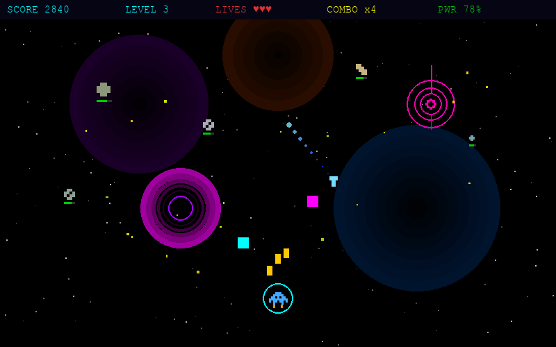
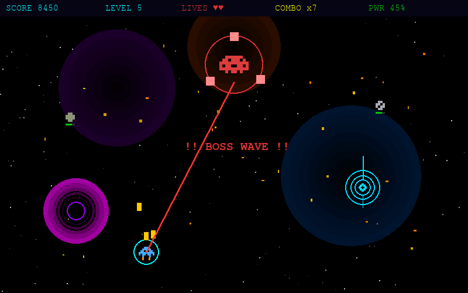

# Cosmic Blaster

A pixel-art space shooter built with Pygame. Pilot your ship through waves of asteroids, comets, quasars, and black holes — then face off against massive bosses.


---

## Preview





---

## Gameplay

Navigate through increasingly difficult waves of space hazards. Collect power-ups from space stations, upgrade your weapons, and survive as long as you can.

Every 5th wave summons a Boss with multiple attack phases.

### Controls

| Key | Action |
|-----|--------|
| WASD / Arrow Keys | Move ship |
| Space | Shoot |
| Enter | Start / Restart |
| Escape | Quit |

---

## Enemies & Hazards

- **Asteroid** — drifting space rocks of varying sizes
- **Comet** — fast-moving with a fiery trail, weaves across the screen
- **Quasar** — energy orb that fires spread shots at the player
- **Black Hole** — pulls the player and bullets toward its core
- **Boss** — large warship with three attack phases that gets harder each encounter

## Pickups

- **Heal** (green cross) — restores 2 HP
- **Power** (yellow arrow) — upgrades weapon spread (max level 3)
- **Shield** (cyan ring) — temporary invincibility

---

## Getting Started

```bash
git clone https://github.com/StarryMartlet/cosmic-blaster.git
cd cosmic-blaster
pip install -r requirements.txt
python cosmic_blaster.py
```

---

## Tech Stack

| Tool | Purpose |
|------|---------|
| Python 3.10+ | Core language |
| Pygame 2.5+ | Game engine, rendering, input |

---

## Author

**Karina Bahrii** — Python Developer & Astronomy enthusiast

[](https://github.com/StarryMartlet)
[](https://www.linkedin.com/in/karina-bahrii-b737a63b3/)
